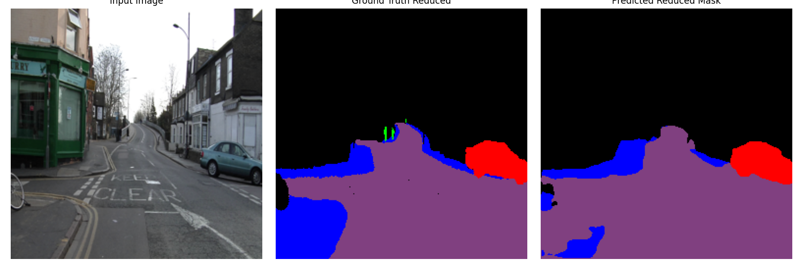
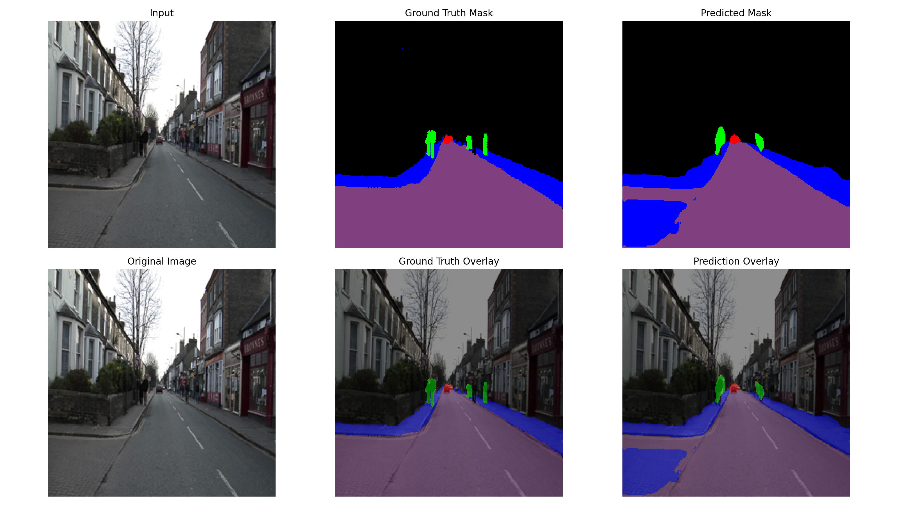
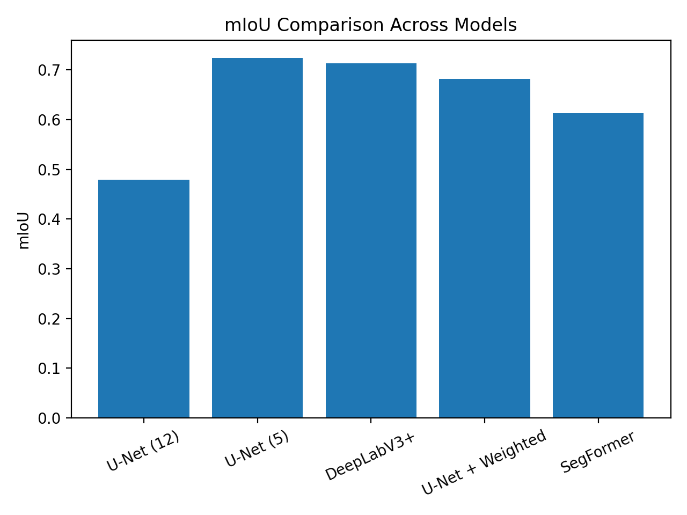
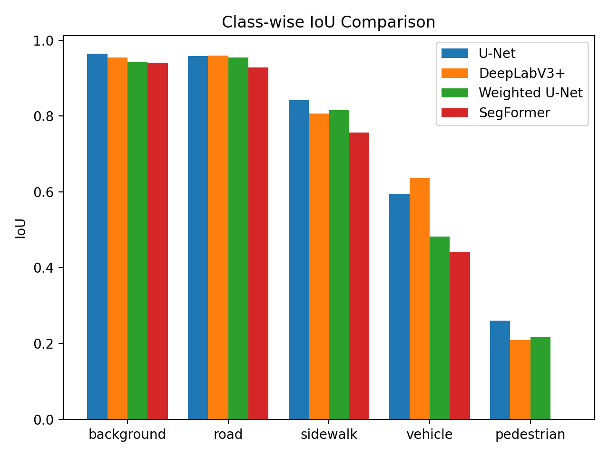

# Semantic Segmentation for Road and Dynamic Object Understanding in Autonomous Driving


## Overview

This repository presents a semantic segmentation study for urban road-scene understanding, with emphasis on autonomous-driving perception. The project compares convolutional and transformer-based segmentation architectures under a reduced, safety-critical label space.

The central research question is how architecture choice, label-space formulation, and loss weighting affect segmentation quality for both static road-scene structures and dynamic objects such as vehicles and pedestrians.

---

## Research Contributions

* End-to-end semantic segmentation pipeline for urban driving scenes.
* Comparison between CNN-based and transformer-based architectures.
* Reduction of the original CamVid label space into a safety-oriented 5-class formulation.
* Evaluation of class imbalance handling through weighted cross-entropy loss.
* Quantitative evaluation using mIoU and class-wise IoU.
* Qualitative assessment using prediction masks, overlays, and performance plots.

---

## Dataset

The experiments are conducted on the **CamVid dataset**, a benchmark dataset for road-scene semantic segmentation.

### Reduced Label Space

The original 12 CamVid classes were mapped into 5 higher-level categories that are directly relevant to autonomous-driving perception:

| Reduced class | Interpretation |
| --- | --- |
| Background | Non-critical or merged scene elements |
| Road | Drivable road surface |
| Sidewalk | Pedestrian-side navigable area |
| Vehicle | Cars and other road vehicles |
| Pedestrian | Human road users |

This reduced formulation improves interpretability and allows the analysis to focus on safety-critical perception categories.

---

## Models

### CNN-based architectures

* **U-Net with ResNet34 encoder**
* **DeepLabV3+**

### Transformer-based architecture

* **SegFormer with MiT-B0 backbone**

---

## Experimental Setup

| Component | Configuration |
| --- | --- |
| Input resolution | 256 × 256 |
| Batch size | 4 |
| CNN optimizer | Adam |
| Transformer optimizer | AdamW |
| CNN learning rate | 1e-3 |
| Transformer learning rate | 5e-5 |
| Loss functions | Cross-Entropy, Weighted Cross-Entropy |
| Primary metric | Mean Intersection over Union |

---

## Installation

Clone the repository and install the required dependencies:

```bash
git clone https://github.com/PanagiotaGr/Semantic-Segmentation-for-Road-and-Dynamic-Object-Understanding-in-Autonomous-Driving.git
cd Semantic-Segmentation-for-Road-and-Dynamic-Object-Understanding-in-Autonomous-Driving
pip install -r requirements.txt
```

> Note: PyTorch installation may depend on the local CUDA version. If needed, install PyTorch using the official command for your hardware configuration.

---

## How to Run

Typical training and inference scripts follow this structure:

```bash
python train_*.py
python predict_*.py
```

Expected workflow:

1. Prepare the CamVid dataset under a local `data/` directory.
2. Train the selected segmentation model.
3. Generate predictions on the test set.
4. Evaluate mIoU and class-wise IoU.
5. Inspect qualitative outputs in `sample_outputs/`, `plots/`, or `results/`.

---

## Evaluation Metrics

The project evaluates segmentation quality using:

* **Mean Intersection over Union (mIoU)**: the main metric for global segmentation performance.
* **Class-wise IoU**: used to identify strengths and weaknesses per semantic category.
* **Qualitative overlays**: used to visually assess boundary quality, object detection, and class confusion.

---

## Results

### Overall Performance

| Model | Label setup | Loss | mIoU |
| --- | --- | --- | ---: |
| U-Net | 12 classes | Cross-Entropy | 0.4797 |
| U-Net | 5 classes | Cross-Entropy | **0.7240** |
| DeepLabV3+ | 5 classes | Cross-Entropy | 0.7132 |
| U-Net | 5 classes | Weighted Cross-Entropy | 0.6823 |
| SegFormer | 5 classes | Cross-Entropy | 0.6135 |

### Class-wise IoU for the Best U-Net Model

| Class | IoU |
| --- | ---: |
| Background | 0.9646 |
| Road | 0.9591 |
| Sidewalk | 0.8424 |
| Vehicle | 0.5944 |
| Pedestrian | 0.2596 |

---

## Ablation Analysis

### Effect of label-space reduction

Reducing the original 12-class problem to a 5-class safety-oriented formulation substantially improved mIoU. This suggests that label-space design is a critical factor in semantic segmentation performance, especially when the objective is not exhaustive scene labeling but safety-relevant road understanding.

### Effect of weighted loss

Weighted cross-entropy was introduced to address class imbalance. However, the weighted-loss U-Net did not outperform the standard 5-class U-Net. This indicates that loss reweighting can introduce trade-offs: it may increase attention to rare classes while reducing stability or performance on dominant classes.

### CNNs versus transformers

In this setup, CNN-based models outperformed the transformer-based SegFormer configuration. This does not imply that transformers are unsuitable for segmentation; rather, it suggests that transformer models may require stronger tuning, larger-scale training, or higher-resolution inputs to fully exploit their representation capacity.

---

## Key Findings

* The reduced 5-class formulation achieved a much higher mIoU than the original 12-class setup.
* U-Net with a ResNet34 encoder achieved the best overall result.
* DeepLabV3+ performed competitively and showed strong potential for vehicle segmentation.
* Weighted cross-entropy did not improve the overall mIoU in this experiment.
* Pedestrian segmentation remained the most difficult class due to small object size and strong class imbalance.
* Architectural complexity alone was not sufficient to guarantee better performance.

---

## Qualitative Results

### Segmentation Examples




### Performance Plots




---

## Discussion

Large and spatially continuous classes such as road and sidewalk achieved high IoU because they occupy consistent and visually structured regions. In contrast, dynamic and small-scale objects such as pedestrians were more difficult to segment because they occupy fewer pixels and appear with greater variation in pose, scale, and occlusion.

The results show that model selection should be considered together with label design, loss function design, data characteristics, and evaluation objectives. For autonomous-driving perception, the best model is not necessarily the most complex one, but the one that provides the best trade-off between accuracy, interpretability, and reliability for safety-critical classes.

---

## Limitations

* The experiments use a reduced input resolution of 256 × 256, which can limit the detection of small objects.
* The pedestrian class remains challenging due to limited pixel representation and class imbalance.
* The SegFormer configuration was not exhaustively tuned.
* Temporal information from video sequences was not used.
* Real-time inference speed was not benchmarked in this version.

---

## Future Work

* Tune transformer-based segmentation models such as SegFormer and Mask2Former.
* Evaluate Focal Loss, Dice Loss, and combined loss functions.
* Use higher-resolution training for improved small-object segmentation.
* Add temporal consistency for video-based segmentation.
* Extend the project toward multi-task learning, such as segmentation and lane detection.
* Benchmark inference speed for real-time autonomous-driving deployment.

---

## Repository Structure

```text
semantic_seg_project/
├── train_*.py
├── predict_*.py
├── results/
├── plots/
├── sample_outputs/
├── requirements.txt
├── .gitignore
└── README.md
```

---

## Reproducibility Notes

For reproducible experiments, future versions should document:

* exact train/validation/test split,
* number of epochs,
* random seed,
* GPU/CPU hardware,
* checkpoint naming convention,
* dataset preprocessing and augmentation details.

---

## Author

Panagiota Grosdouli

---

## License

This project is intended for academic and research purposes. A formal open-source license can be added depending on the intended distribution policy.

---

## Citation

```bibtex
@software{Grosdouli_Semantic_Segmentation_2026,
  author = {Grosdouli, Panagiota},
  title = {Semantic Segmentation for Road and Dynamic Object Understanding in Autonomous Driving},
  year = {2026},
  url = {https://github.com/PanagiotaGr/Semantic-Segmentation-for-Road-and-Dynamic-Object-Understanding-in-Autonomous-Driving}
}
```
